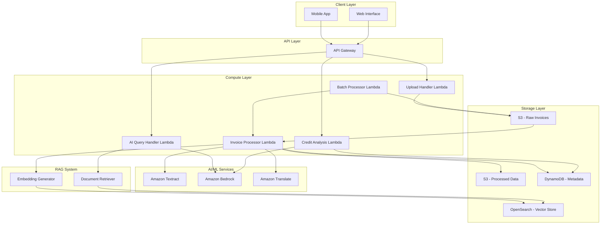

# Design Document: FinLogic Agents

## Overview

FinLogic Agents is a serverless AI-powered platform built on AWS that enables small Indian retailers to digitize physical invoices and gain credit-readiness insights. The system leverages a modern serverless architecture combining Amazon S3 for storage, AWS Lambda for compute, Amazon Textract for OCR, Amazon Bedrock for AI capabilities, and a RAG (Retrieval Augmented Generation) system for contextual intelligence.

The platform is designed to be cost-effective, scalable, and accessible to users with varying levels of technical expertise. By supporting multiple Indian regional languages and providing actionable financial insights, FinLogic Agents bridges the gap between traditional retail operations and modern financial services.

## Architecture

### High-Level Architecture

The system follows a serverless event-driven architecture pattern:



### Architecture Principles

1. **Serverless-First**: All compute resources use AWS Lambda to minimize operational overhead and costs
2. **Event-Driven**: S3 events trigger processing pipelines automatically
3. **Separation of Concerns**: Each Lambda function has a single, well-defined responsibility
4. **Scalability**: Auto-scaling at every layer to handle variable loads
5. **Cost Optimization**: Pay-per-use model with intelligent storage tiering
6. **Security**: Encryption at rest and in transit, IAM-based access control

## Components and Interfaces

### 1. API Gateway

**Purpose**: Serves as the entry point for all client requests, providing RESTful API endpoints.

**Endpoints**:
- `POST /invoices/upload` - Upload single invoice
- `POST /invoices/batch` - Upload multiple invoices
- `GET /invoices/{id}` - Retrieve invoice details
- `GET /invoices/search` - Search invoices with filters
- `POST /analysis/credit` - Request credit analysis
- `POST /query` - Ask AI-powered questions
- `GET /invoices/{id}/status` - Check processing status

**Configuration**:
- Request validation and throttling (1000 requests/second per user)
- CORS enabled for web clients
- API key authentication with JWT tokens
- Request/response logging to CloudWatch

### 2. Upload Handler Lambda

**Purpose**: Handles invoice upload requests and stores files in S3.

**Input**:
```json
{
  "userId": "string",
  "fileName": "string",
  "fileType": "string",
  "fileSize": "number",
  "base64Data": "string",
  "language": "string (optional)"
}
```

**Output**:
```json
{
  "invoiceId": "string",
  "uploadUrl": "string (for large files)",
  "status": "uploaded | pending",
  "message": "string"
}
```

**Processing Logic**:
1. Validate file size and format
2. Generate unique invoice ID
3. For files < 5MB: decode base64 and upload directly to S3
4. For files >= 5MB: generate presigned S3 URL for direct upload
5. Store metadata in DynamoDB
6. Return confirmation to client

**Configuration**:
- Memory: 512 MB
- Timeout: 30 seconds
- Concurrency: 100

### 3. Invoice Processor Lambda

**Purpose**: Extracts data from invoices using Textract and prepares data for RAG system.

**Trigger**: S3 event when new invoice is uploaded to raw bucket

**Processing Pipeline**:
1. Retrieve invoice from S3
2. Call Amazon Textract for OCR processing
3. Parse Textract response to extract structured fields
4. Detect language using Amazon Comprehend
5. If non-English, translate key fields using Amazon Translate
6. Generate embeddings for invoice content
7. Store embeddings in OpenSearch vector store
8. Save structured data to S3 processed bucket
9. Update DynamoDB with processing status

**Textract Integration**:
```python
# Pseudocode for Textract processing
function processInvoice(s3Bucket, s3Key):
    response = textract.analyzeDocument(
        Document={'S3Object': {'Bucket': s3Bucket, 'Name': s3Key}},
        FeatureTypes=['TABLES', 'FORMS']
    )
    
    extractedData = {
        'vendorName': extractField(response, 'VENDOR'),
        'invoiceDate': extractField(response, 'DATE'),
        'totalAmount': extractField(response, 'TOTAL'),
        'items': extractTable(response),
        'taxAmount': extractField(response, 'TAX'),
        'confidence': calculateConfidence(response)
    }
    
    return extractedData
```

**Configuration**:
- Memory: 1024 MB
- Timeout: 5 minutes
- Concurrency: 50
- Retry: 3 attempts with exponential backoff

### 4. Credit Analysis Lambda

**Purpose**: Analyzes retailer's financial data and generates credit-readiness scores.

**Input**:
```json
{
  "userId": "string",
  "analysisType": "full | quick",
  "dateRange": {
    "start": "ISO8601 date",
    "end": "ISO8601 date"
  }
}
```

**Output**:
```json
{
  "creditScore": "number (300-900)",
  "scoreFactors": {
    "revenueConsistency": "number",
    "paymentHistory": "number",
    "inventoryTurnover": "number",
    "profitMargin": "number"
  },
  "recommendations": ["string"],
  "trends": {
    "revenue": "increasing | stable | decreasing",
    "expenses": "increasing | stable | decreasing"
  },
  "reportUrl": "string"
}
```

**Analysis Algorithm**:
```python
# Pseudocode for credit scoring
function calculateCreditScore(userId, invoices):
    # Calculate revenue metrics
    totalRevenue = sum(invoice.amount for invoice in invoices)
    avgMonthlyRevenue = totalRevenue / monthCount
    revenueStdDev = standardDeviation(monthlyRevenues)
    revenueConsistency = 1 - (revenueStdDev / avgMonthlyRevenue)
    
    # Calculate payment patterns
    paymentIntervals = calculatePaymentIntervals(invoices)
    paymentConsistency = analyzePaymentRegularity(paymentIntervals)
    
    # Calculate inventory turnover
    inventoryTurnover = totalRevenue / avgInventoryValue
    
    # Calculate profit margins
    profitMargin = (totalRevenue - totalExpenses) / totalRevenue
    
    # Weighted scoring
    baseScore = 300
    revenueScore = revenueConsistency * 200
    paymentScore = paymentConsistency * 200
    turnoverScore = min(inventoryTurnover / 12, 1) * 100
    profitScore = profitMargin * 100
    
    creditScore = baseScore + revenueScore + paymentScore + turnoverScore + profitScore
    
    return clamp(creditScore, 300, 900)
```

**Bedrock Integration for Recommendations**:
- Uses Claude 3 Sonnet model for generating personalized recommendations
- Provides context including credit score, trends, and industry benchmarks
- Generates actionable advice in retailer's preferred language

**Configuration**:
- Memory: 2048 MB
- Timeout: 2 minutes
- Concurrency: 20

### 5. AI Query Handler Lambda

**Purpose**: Handles natural language queries using RAG and Amazon Bedrock.

**Input**:
```json
{
  "userId": "string",
  "query": "string",
  "language": "string",
  "conversationId": "string (optional)"
}
```

**Output**:
```json
{
  "response": "string",
  "sources": ["invoiceId"],
  "confidence": "number",
  "conversationId": "string"
}
```

**RAG Pipeline**:
```python
# Pseudocode for RAG query processing
function handleQuery(userId, query, language):
    # Step 1: Generate query embedding
    queryEmbedding = generateEmbedding(query)
    
    # Step 2: Retrieve relevant documents
    relevantDocs = vectorStore.search(
        embedding=queryEmbedding,
        filter={'userId': userId},
        topK=5,
        minScore=0.7
    )
    
    # Step 3: Build context from retrieved documents
    context = buildContext(relevantDocs)
    
    # Step 4: Generate prompt for Bedrock
    prompt = f"""
    You are a financial advisor for small Indian retailers.
    
    Context from user's invoices:
    {context}
    
    User question: {query}
    
    Provide a helpful, accurate response based on the context.
    If the context doesn't contain relevant information, say so.
    """
    
    # Step 5: Call Bedrock
    response = bedrock.invokeModel(
        modelId='anthropic.claude-3-sonnet-20240229-v1:0',
        body={
            'prompt': prompt,
            'max_tokens': 1000,
            'temperature': 0.7
        }
    )
    
    # Step 6: Translate if needed
    if language != 'en':
        response = translate(response, targetLanguage=language)
    
    return response
```

**Configuration**:
- Memory: 1024 MB
- Timeout: 30 seconds
- Concurrency: 50

### 6. Batch Processor Lambda

**Purpose**: Handles batch invoice uploads efficiently.

**Processing Strategy**:
1. Receive batch upload request with multiple files
2. Store all files in S3 with batch identifier
3. Trigger Invoice Processor Lambda for each file asynchronously
4. Track batch progress in DynamoDB
5. Send notification when batch completes

**Configuration**:
- Memory: 512 MB
- Timeout: 5 minutes
- Concurrency: 10

## Data Models

### Invoice Metadata (DynamoDB)

**Table Name**: `finlogic-invoices`

**Primary Key**: 
- Partition Key: `userId` (String)
- Sort Key: `invoiceId` (String)

**Attributes**:
```json
{
  "userId": "string",
  "invoiceId": "string",
  "uploadTimestamp": "number",
  "processingStatus": "uploaded | processing | completed | failed",
  "fileName": "string",
  "fileSize": "number",
  "s3RawKey": "string",
  "s3ProcessedKey": "string",
  "language": "string",
  "extractedData": {
    "vendorName": "string",
    "invoiceDate": "string",
    "totalAmount": "number",
    "currency": "string",
    "items": [
      {
        "description": "string",
        "quantity": "number",
        "unitPrice": "number",
        "amount": "number"
      }
    ],
    "taxAmount": "number",
    "confidence": "number"
  },
  "embeddingId": "string",
  "lastModified": "number"
}
```

**Global Secondary Indexes**:
1. `ProcessingStatusIndex`: `processingStatus` (PK) + `uploadTimestamp` (SK)
2. `DateIndex`: `userId` (PK) + `invoiceDate` (SK)

### User Profile (DynamoDB)

**Table Name**: `finlogic-users`

**Primary Key**: `userId` (String)

**Attributes**:
```json
{
  "userId": "string",
  "businessName": "string",
  "ownerName": "string",
  "phoneNumber": "string",
  "email": "string",
  "preferredLanguage": "string",
  "businessType": "string",
  "registrationDate": "number",
  "lastLoginDate": "number",
  "creditScore": "number",
  "lastCreditAnalysis": "number",
  "totalInvoices": "number",
  "settings": {
    "notifications": "boolean",
    "autoAnalysis": "boolean"
  }
}
```

### Vector Store (OpenSearch)

**Index Name**: `invoice-embeddings`

**Document Structure**:
```json
{
  "embeddingId": "string",
  "userId": "string",
  "invoiceId": "string",
  "embedding": [float],  // 1536-dimensional vector
  "content": "string",   // Concatenated invoice text
  "metadata": {
    "vendorName": "string",
    "amount": "number",
    "date": "string",
    "category": "string"
  },
  "timestamp": "number"
}
```

**Vector Configuration**:
- Embedding Model: Amazon Bedrock Titan Embeddings
- Dimensions: 1536
- Similarity Metric: Cosine similarity
- Index Type: HNSW (Hierarchical Navigable Small World)

### Credit Analysis Report (S3)

**Storage Location**: `s3://finlogic-reports/{userId}/credit-analysis-{timestamp}.json`

**Structure**:
```json
{
  "userId": "string",
  "analysisDate": "string",
  "reportId": "string",
  "creditScore": "number",
  "scoreBreakdown": {
    "revenueConsistency": {
      "score": "number",
      "weight": "number",
      "details": "string"
    },
    "paymentHistory": {
      "score": "number",
      "weight": "number",
      "details": "string"
    },
    "inventoryTurnover": {
      "score": "number",
      "weight": "number",
      "details": "string"
    },
    "profitMargin": {
      "score": "number",
      "weight": "number",
      "details": "string"
    }
  },
  "trends": {
    "revenue": {
      "direction": "string",
      "monthlyData": [number],
      "growthRate": "number"
    },
    "expenses": {
      "direction": "string",
      "monthlyData": [number],
      "growthRate": "number"
    }
  },
  "recommendations": [
    {
      "category": "string",
      "priority": "high | medium | low",
      "recommendation": "string",
      "expectedImpact": "string"
    }
  ],
  "industryBenchmarks": {
    "avgCreditScore": "number",
    "avgRevenue": "number",
    "avgProfitMargin": "number"
  }
}
```

## Correctness Properties

*A property is a characteristic or behavior that should hold true across all valid executions of a system—essentially, a formal statement about what the system should do. Properties serve as the bridge between human-readable specifications and machine-verifiable correctness guarantees.*


### Property 1: Upload Success Returns Unique Identifier

*For any* valid invoice upload (JPEG, PNG, or PDF under 10MB), the system should store the file in S3 and return a confirmation with a unique invoice identifier.

**Validates: Requirements 1.1, 1.2, 1.4**

### Property 2: Resumable Upload Support

*For any* file larger than 5MB, if the upload is interrupted, the system should allow resuming from the last successful chunk.

**Validates: Requirements 1.5**

### Property 3: Invoice Data Extraction Completeness

*For any* processed invoice, the extracted structured data should include vendor name, date, amount, items, and tax details in JSON format.

**Validates: Requirements 2.2, 2.4**

### Property 4: Language Detection and Processing

*For any* invoice in a supported regional language (Hindi, Tamil, Telugu, Kannada, Malayalam, Bengali, Marathi, Gujarati), the system should detect the language and extract data accordingly.

**Validates: Requirements 2.5, 3.1**

### Property 5: Retry Logic for Failed Processing

*For any* Textract processing failure, the system should retry up to 3 times with exponential backoff before marking as failed.

**Validates: Requirements 2.6**

### Property 6: Bilingual Data Preservation

*For any* regional language invoice, the system should store both the original language data and English translations.

**Validates: Requirements 3.4**

### Property 7: Response Language Matching

*For any* AI-generated insight or response, the output language should match the retailer's selected language preference.

**Validates: Requirements 3.2**

### Property 8: Credit Score Range Invariant

*For any* credit analysis, the generated credit score must be between 300 and 900 inclusive.

**Validates: Requirements 4.3**

### Property 9: Credit Analysis Completeness

*For any* credit analysis request with sufficient data, the system should calculate revenue trends, payment consistency, inventory turnover, and profit margins, and generate a detailed report with recommendations.

**Validates: Requirements 4.1, 4.2, 4.4, 4.6**

### Property 10: RAG Document Retrieval

*For any* retailer query, the RAG system should retrieve relevant documents from the vector store and use them to generate contextual responses.

**Validates: Requirements 5.2, 5.5**

### Property 11: Source Citation

*For any* AI-generated insight, the response should include references to specific invoices or data points used as evidence.

**Validates: Requirements 5.5**

### Property 12: Authentication Required for Data Access

*For any* attempt to access invoice data, the system should verify user authentication before granting access.

**Validates: Requirements 6.3**

### Property 13: PII Masking in Logs

*For any* logged data, personally identifiable information (PII) should be masked or redacted.

**Validates: Requirements 6.4**

### Property 14: Data Deletion Compliance

*For any* data deletion request, the system should remove all associated data within 30 days.

**Validates: Requirements 6.5**

### Property 15: Search Filter Application

*For any* invoice search with filters (date range, vendor, amount, status), the results should only include invoices matching all specified criteria, and should support sorting by date, amount, and vendor name.

**Validates: Requirements 7.1, 7.4**

### Property 16: Invoice View Completeness

*For any* invoice retrieval, the system should return both the original image and the extracted structured data.

**Validates: Requirements 7.3**

### Property 17: Export Data Completeness

*For any* data export request, the generated CSV or Excel file should contain all invoice details for the selected invoices.

**Validates: Requirements 7.5**

### Property 18: Error Logging

*For any* error that occurs during processing, the system should create a log entry with contextual information including timestamp, user ID, operation, and error details.

**Validates: Requirements 9.1**

### Property 19: Critical Error Notifications

*For any* critical error (system failure, data corruption, security breach), the system should send notifications to administrators.

**Validates: Requirements 9.2**

### Property 20: Localized Error Messages

*For any* processing failure, the error message returned to the user should be in their preferred language.

**Validates: Requirements 9.3**

### Property 21: Embedding Storage

*For any* successfully processed invoice, the system should generate and store embeddings in the vector store.

**Validates: Requirements 10.1**

### Property 22: Top-K Document Retrieval

*For any* query to the RAG system, the system should retrieve up to 5 most relevant documents with similarity scores above 0.7.

**Validates: Requirements 10.2, 10.5**

### Property 23: Batch Processing Summary

*For any* completed batch upload, the system should generate a summary report showing total count, success count, and failure count.

**Validates: Requirements 11.3**

### Property 24: Batch Partial Failure Handling

*For any* batch upload where some invoices fail processing, the system should continue processing remaining invoices and report individual statuses.

**Validates: Requirements 11.4**

### Property 25: Batch Progress Tracking

*For any* batch upload in progress, the system should provide a progress indicator showing the percentage of invoices processed.

**Validates: Requirements 11.5**

### Property 26: Mobile Image Compression

*For any* invoice upload from a mobile device, the system should compress the image before transmission to reduce data usage.

**Validates: Requirements 12.4**

### Property 27: Offline Sync

*For any* invoice captured offline on a mobile device, the system should automatically sync the data when connectivity is restored.

**Validates: Requirements 12.5**

## Error Handling

### Error Categories

1. **Client Errors (4xx)**
   - Invalid file format
   - File size exceeded
   - Missing required fields
   - Authentication failure
   - Insufficient permissions

2. **Server Errors (5xx)**
   - Textract service unavailable
   - Bedrock service unavailable
   - Database connection failure
   - S3 storage failure
   - Timeout errors

3. **Processing Errors**
   - Low OCR confidence
   - Language detection failure
   - Embedding generation failure
   - Insufficient data for analysis

### Error Handling Strategies

**Retry Logic**:
```python
# Pseudocode for exponential backoff retry
function retryWithBackoff(operation, maxRetries=3):
    retries = 0
    baseDelay = 1  # second
    
    while retries < maxRetries:
        try:
            return operation()
        except RetryableError as e:
            retries += 1
            if retries >= maxRetries:
                raise MaxRetriesExceeded(e)
            
            delay = baseDelay * (2 ** retries)  # Exponential backoff
            sleep(delay)
            log(f"Retry {retries}/{maxRetries} after {delay}s")
```

**Circuit Breaker Pattern**:
- Implement circuit breaker for external service calls (Textract, Bedrock)
- Open circuit after 5 consecutive failures
- Half-open state after 30 seconds
- Close circuit after 2 successful calls

**Graceful Degradation**:
- If Bedrock is unavailable, return cached responses or basic analysis
- If Textract fails, allow manual data entry
- If vector store is unavailable, use basic keyword search

**Error Response Format**:
```json
{
  "error": {
    "code": "string",
    "message": "string",
    "details": "string",
    "timestamp": "ISO8601",
    "requestId": "string",
    "retryable": "boolean"
  }
}
```

**Localized Error Messages**:
- All error messages translated to user's preferred language
- Error codes remain consistent across languages
- Include actionable guidance in error messages

### Dead Letter Queues

- Failed Lambda invocations sent to DLQ
- Failed Textract jobs sent to separate DLQ
- DLQ messages trigger alerts after 3 failures
- Manual review process for DLQ items

## Testing Strategy

### Dual Testing Approach

The testing strategy employs both unit tests and property-based tests to ensure comprehensive coverage:

- **Unit tests**: Verify specific examples, edge cases, and error conditions
- **Property tests**: Verify universal properties across all inputs
- Both approaches are complementary and necessary for comprehensive coverage

### Unit Testing

Unit tests focus on:
- Specific examples that demonstrate correct behavior
- Integration points between components (Lambda to S3, Lambda to Textract)
- Edge cases (file size limits, confidence thresholds, batch size limits)
- Error conditions (invalid formats, service failures, authentication errors)

**Example Unit Tests**:
- Test upload with exactly 10MB file (boundary condition)
- Test Textract response parsing with sample invoice
- Test credit score calculation with known dataset
- Test language detection with sample invoices in each supported language
- Test authentication failure scenarios
- Test batch upload with exactly 50 invoices (maximum)

### Property-Based Testing

Property-based testing will be implemented using the appropriate library for the chosen programming language:
- **Python**: Hypothesis
- **TypeScript/JavaScript**: fast-check
- **Java**: jqwik
- **Go**: gopter

**Configuration**:
- Each property test must run minimum 100 iterations
- Each test must reference its design document property
- Tag format: **Feature: finlogic-agents, Property {number}: {property_text}**

**Property Test Examples**:

1. **Upload Success Property** (Property 1):
   - Generate random valid invoices (various formats, sizes)
   - Upload each invoice
   - Verify unique ID returned and file stored in S3

2. **Credit Score Range Property** (Property 8):
   - Generate random invoice datasets
   - Calculate credit score
   - Assert score is between 300 and 900

3. **Language Matching Property** (Property 7):
   - Generate random queries in different languages
   - Request insights
   - Verify response language matches request language

4. **Search Filter Property** (Property 15):
   - Generate random invoice datasets
   - Apply random filter combinations
   - Verify all results match filter criteria

5. **Batch Partial Failure Property** (Property 24):
   - Generate batches with mix of valid and invalid invoices
   - Process batch
   - Verify valid invoices processed, invalid ones reported

### Integration Testing

- End-to-end tests for complete workflows:
  - Upload → Process → Extract → Store → Query
  - Upload → Analyze → Generate Report
  - Batch Upload → Process All → Generate Summary
- Test AWS service integrations (S3, Lambda, Textract, Bedrock)
- Test RAG pipeline (Embed → Store → Retrieve → Generate)

### Performance Testing

- Load testing with 100 concurrent uploads
- Stress testing with large batches (50 invoices)
- Latency testing for query responses (target: 5 seconds)
- Vector search performance with 10,000+ embeddings

### Security Testing

- Authentication and authorization tests
- Encryption verification (at rest and in transit)
- PII masking validation
- Penetration testing for API endpoints

### Monitoring and Observability

**CloudWatch Metrics**:
- Lambda invocation count, duration, errors
- API Gateway request count, latency, 4xx/5xx errors
- S3 storage usage, request count
- DynamoDB read/write capacity, throttles
- Textract job success rate, processing time
- Bedrock invocation count, token usage

**CloudWatch Logs**:
- Structured logging with JSON format
- Log levels: DEBUG, INFO, WARN, ERROR, CRITICAL
- Correlation IDs for request tracing
- PII masking in all logs

**X-Ray Tracing**:
- End-to-end request tracing
- Service map visualization
- Performance bottleneck identification
- Error rate analysis by component

**Alarms**:
- Lambda error rate > 5%
- API Gateway 5xx rate > 1%
- Textract failure rate > 10%
- DynamoDB throttling events
- S3 4xx error rate > 5%
- Credit analysis processing time > 2 minutes

## Deployment Strategy

### Infrastructure as Code

Use AWS CDK or Terraform to define all infrastructure:
- Lambda functions with appropriate IAM roles
- S3 buckets with lifecycle policies and encryption
- DynamoDB tables with auto-scaling
- API Gateway with throttling and caching
- OpenSearch cluster for vector store
- CloudWatch alarms and dashboards

### CI/CD Pipeline

1. **Build Stage**:
   - Run unit tests
   - Run property-based tests (100 iterations each)
   - Code quality checks (linting, formatting)
   - Security scanning (dependency vulnerabilities)

2. **Deploy to Dev**:
   - Deploy infrastructure changes
   - Deploy Lambda functions
   - Run integration tests
   - Run smoke tests

3. **Deploy to Staging**:
   - Deploy infrastructure changes
   - Deploy Lambda functions
   - Run full test suite
   - Run performance tests
   - Manual approval gate

4. **Deploy to Production**:
   - Blue-green deployment
   - Gradual traffic shifting (10% → 50% → 100%)
   - Automated rollback on error rate increase
   - Post-deployment verification

### Environment Configuration

- **Dev**: Minimal resources, frequent deployments
- **Staging**: Production-like, full test suite
- **Production**: High availability, auto-scaling, monitoring

## Cost Optimization

### Storage Tiering

- **S3 Intelligent-Tiering**: Automatic cost optimization
- **Lifecycle Policies**:
  - Move to Infrequent Access after 30 days
  - Move to Glacier after 90 days
  - Delete after 7 years (compliance requirement)

### Lambda Optimization

- Right-size memory allocation based on profiling
- Use Lambda Provisioned Concurrency for predictable workloads
- Optimize cold start times (< 1 second)
- Reuse connections and SDK clients

### DynamoDB Optimization

- Use on-demand billing for unpredictable workloads
- Use provisioned capacity with auto-scaling for predictable workloads
- Implement caching with DAX for read-heavy workloads
- Use DynamoDB Streams for event-driven processing

### Bedrock Cost Management

- Cache common queries and responses
- Implement rate limiting per user
- Use smaller models for simple queries
- Monitor token usage and set budgets

### Monitoring Costs

- Set up AWS Cost Explorer alerts
- Tag all resources for cost allocation
- Review cost reports monthly
- Optimize based on usage patterns

## Security Considerations

### Authentication and Authorization

- **User Authentication**: Cognito User Pools
- **API Authentication**: JWT tokens with 1-hour expiration
- **Service-to-Service**: IAM roles and policies
- **MFA**: Optional for high-value accounts

### Data Protection

- **Encryption at Rest**: AES-256 for S3 and DynamoDB
- **Encryption in Transit**: TLS 1.3 for all communications
- **Key Management**: AWS KMS with automatic rotation
- **Data Residency**: Store data in Indian AWS regions (Mumbai)

### Compliance

- **Data Protection**: Comply with Indian IT Act and DPDP Act
- **Financial Regulations**: Follow RBI guidelines for financial data
- **Audit Logging**: Maintain audit trail for all data access
- **Data Retention**: 7-year retention for financial records

### Vulnerability Management

- Regular security assessments
- Dependency scanning in CI/CD
- Penetration testing quarterly
- Security patch management

## Scalability Considerations

### Horizontal Scaling

- Lambda auto-scales to handle concurrent requests
- API Gateway handles millions of requests per second
- DynamoDB auto-scales read/write capacity
- S3 automatically scales storage

### Vertical Scaling

- Increase Lambda memory for compute-intensive tasks
- Use larger OpenSearch instances for vector store
- Optimize database queries and indexes

### Caching Strategy

- **API Gateway Caching**: Cache GET requests for 5 minutes
- **CloudFront**: Cache static assets and common responses
- **Application-Level**: Cache credit analysis reports for 24 hours
- **DynamoDB DAX**: Cache frequently accessed invoice metadata

### Rate Limiting

- API Gateway: 1000 requests/second per user
- Bedrock: 100 requests/minute per user
- Textract: 50 concurrent jobs per account
- Batch uploads: 10 concurrent batches per user

## Future Enhancements

1. **Real-time Collaboration**: Multiple users from same business
2. **Predictive Analytics**: Forecast revenue and expenses
3. **Integration with Banks**: Direct loan application submission
4. **Voice Interface**: Voice queries in regional languages
5. **WhatsApp Integration**: Upload invoices via WhatsApp
6. **Automated Categorization**: ML-based expense categorization
7. **Fraud Detection**: Identify suspicious invoices
8. **Multi-currency Support**: Handle international transactions
9. **GST Compliance**: Automated GST return preparation
10. **Supplier Network**: Connect with suppliers for better terms
